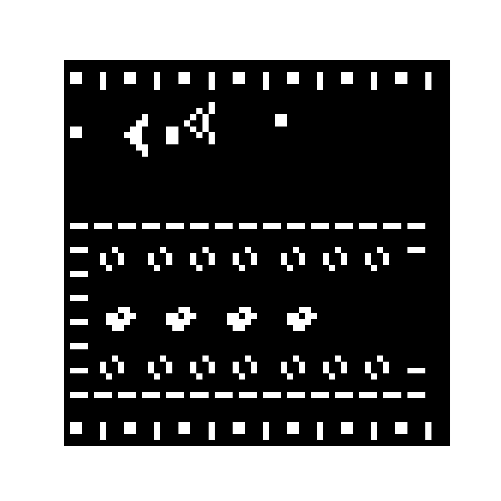
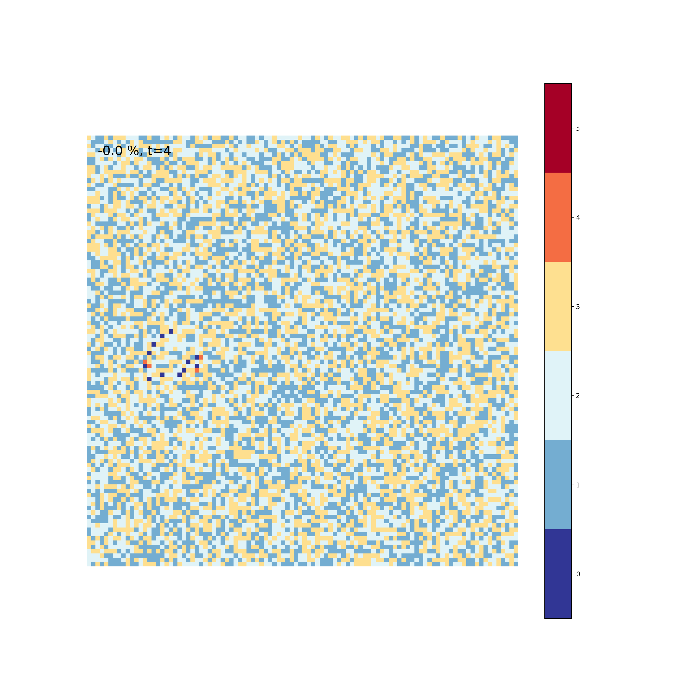

# Cellular automata

A [*cellular automaton*](https://en.wikipedia.org/wiki/Cellular_automaton) follows the evolution of a grid based on certain pre-defined rules. Here are a few scripts that use python and matplotlib to create animations of them.

## Game of Life

Maybe the most famous cellular automaton is [*Conway's Game of Life*](https://en.wikipedia.org/wiki/Conway%27s_Game_of_Life). The rules are as follows

1. Any live cell with fewer than two live neighbors dies, as if by under population.

2. Any live cell with two or three live neighbors lives on to the next generation.

3. Any live cell with more than three live neighbors dies, as if by overpopulation.

4. Any dead cell with exactly three live neighbors becomes a live cell, as if by reproduction.

The script reads a png image (`input.png`) as the starting configuration and treats black pixels as dead and white pixels as alive.

## Sandpile model

Another example is the [*Abelian sandpile model*](https://en.wikipedia.org/wiki/Abelian_sandpile_model). The rules are

1. Randomly add one grain of sand to one cell.

2. If the number of grains in a cell is >=4, the cell is unstable. Reduce the number of grains by 4 and add one grain to each direct neighbors. Repeat this until all cells are stable again and return to 1

